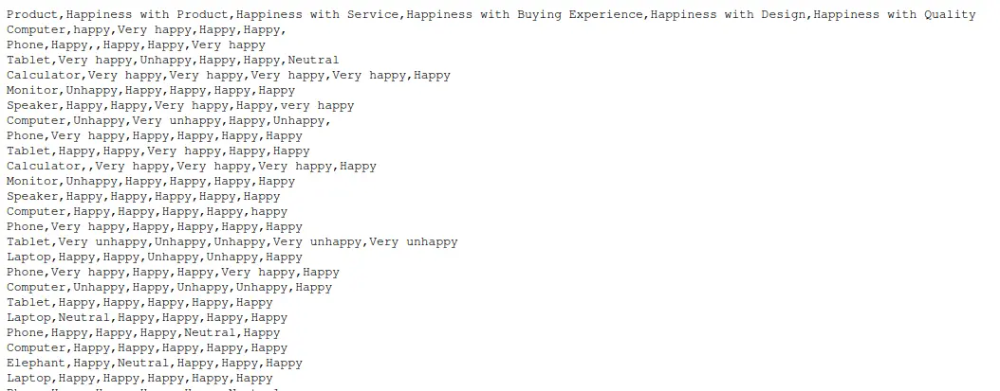
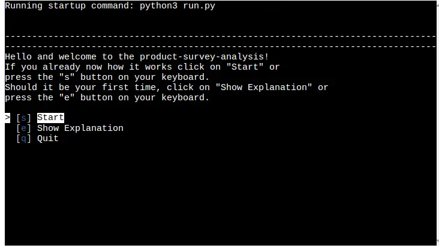
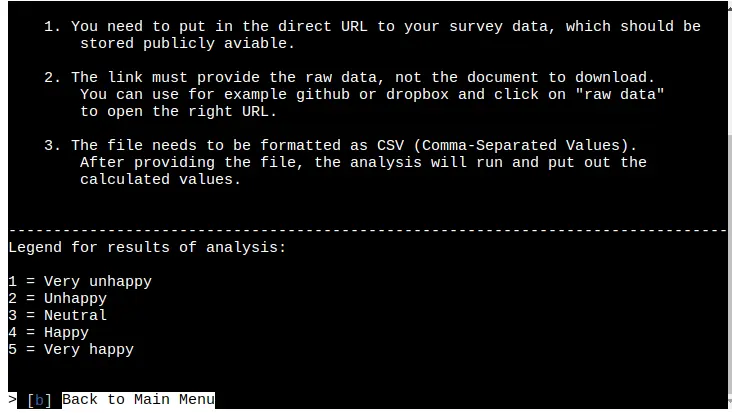
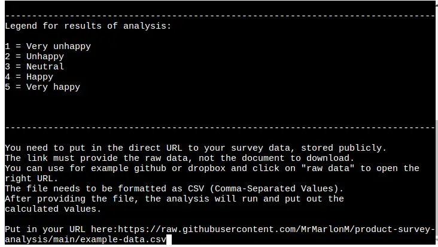
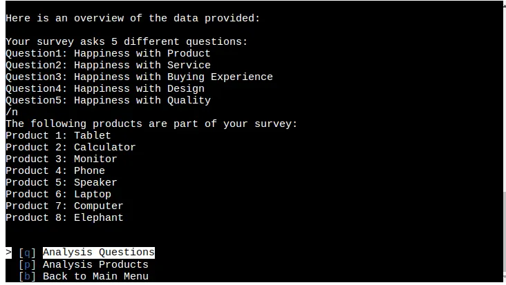
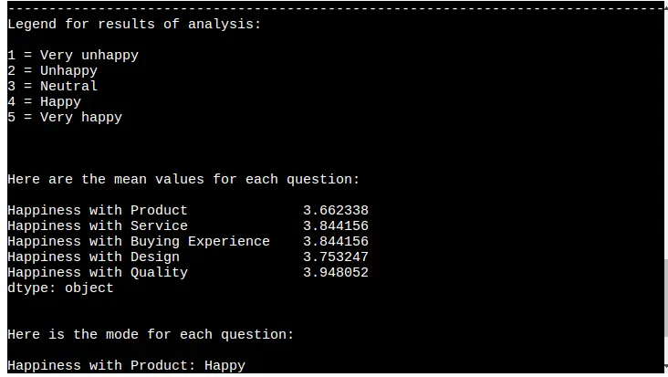
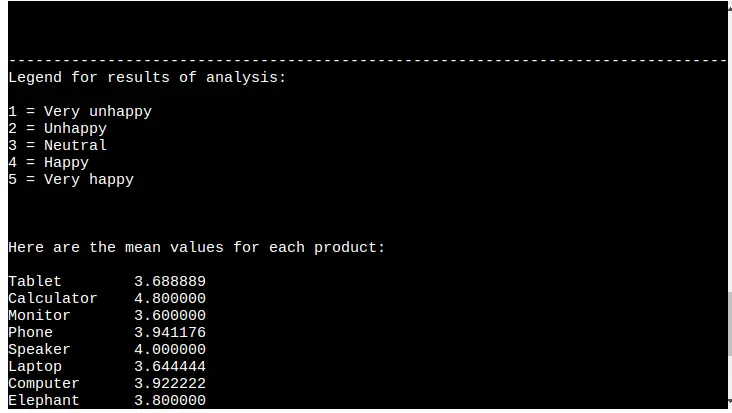
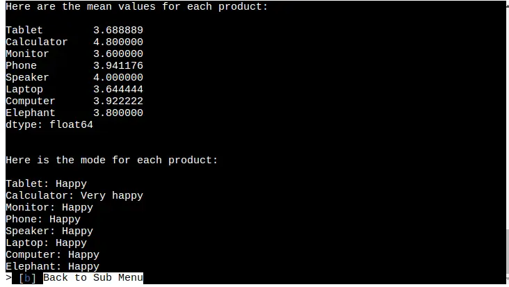
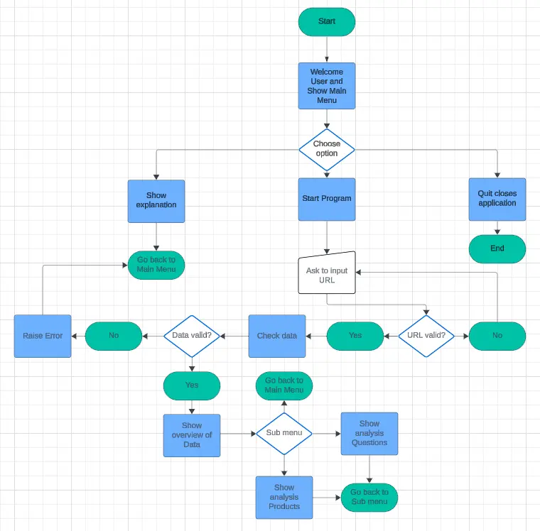

# Product Survey Analysis
This program will help you analyze your product survey!  
Just provide your CSV file with the raw data and wait for the program to
calculate the information you need.  

Click here for the deployed version on Heroku:
- [Product-Survey-Analysis](https://product-survey-analysis-0eda41c09d36.herokuapp.com/)

## Software Requirements
The following version of python:
- Python 3.12.3

The following libraries need to be installed to run the program:
- numpy version 1.26.4
- pandas version 2.2.2
- pytz version 2024.1
- tzdata version 2024.1
- requests version 2.31.0
- validators version 0.28.2
- simple-term-menu version 1.6.4

## Data Requirements
- The survey data needs to be in CSV (Comma-Separated-Values) format.
- The data needs to be provided as a URL.
- The URL needs to link directly to the raw data on a publicly available site like Github or Dropbox for example.
- The "Product" column and answer options are case-sensitive!
- The first row is for the heading with:
    - One column that is named "Product". (required)
    - One or more questions that are written directly in the heading. (min. 1)
- The allowed answer options for this version are:
    - Very unhappy
    - Unhappy
    - Neutral
    - Happy
    - Very happy

Rows that contain answers that are not part of the allowed group, make sure to use the exact spelling, will be deleted completely. Please make sure that the provided data is mostly correct to gain as statistically valuable as possible insights. 

Here is a picture of example data that meets the requirements:  

## User Stories
### First Time Visitor
- I want to understand the purpose of the program
- I want to be able to directly start analyzing some data
- I want to get a clear and concise instruction

### Frequent Visitor 
- I want to analyze more surveys easily
- I want to download the result
- I want to get a more in-depth analysis

## User Guide
When starting the program the user will be presented the start screen with a welcome message and a menu with three options to choose from. 

When clicking on the `[q] Quit` option the program ends and needs to be restarted.  
For a short introduction how to use the program properly the `[e] Show Explanation` option is provided which brings the user to the following screen:   

  

When clicking `Back to Main Menu` the user gets again the Main Menu from the beginning presented and can start the program.  
After starting the program the user gets asked to provide the URL to the raw data of the survey data.

After providing the URL and pressing enter the first part of the analysis runs and provides the user with a short overview of the data. The different questions asked in the survey are shown and the products mentioned in the survey are listed.

In the presented sub-menu the user can then choose between the analysis for the questions and the analysis for the products. Also, the user has the option to go back to the main menu to look again at the explanation, insert a new file or quit the program.  
Here is an example of the provided analysis for the questions:

When clicking on `[p] Analysis Products` the following output is presented to the user:

After clicking on each of the analysis options a `[b] Back to Sub Menu` option is provided that brings the user back to the sub-menu to look at the other analysis option, the overview or to go back to the main menu.

## Flowchart
The logic of the program can be seen in the presented flow chart:

## Technologies Used
### Languages
- [Python 3.12.3:](https://www.python.org/downloads/release/python-3123/) For the logic of the program and the output to the terminal
- [Javascript:](https://www.javascript.com/) To run the script needed for the Code Institute mock terminal
- [HTML:](https://developer.mozilla.org/en-US/docs/Web/HTML) For the construction of the provided Code Institute mock terminal

### Python Libraries
- [io](https://docs.python.org/3/library/io.html) to import `BytesIO` to translate bytes sent by the provided document
- [requests](https://pypi.org/project/requests/) to get the document from the given URL into the program
- [validators](https://pypi.org/project/validators/) to validate that the provided user input is a URL
- [pandas](https://pypi.org/project/pandas/) to analyze the data and transform it into a useable format
- [simple-term-menu](https://pypi.org/project/simple-term-menu/) to create the menu functionality in the terminal

### Tools
- [Gitpod](https://www.gitpod.io/) for writing and editing the code
- [Git](https://git-scm.com/) for the version control of the program
- [GitHub](https://github.com/) for hosting the code of the program
- [Heroku](https://dashboard.heroku.com/) for deploying the program
- [FreeConvert](https://www.freeconvert.com/) for converting images into webp-format
- [Lucidchart](https://www.lucidchart.com/) for creating a Flow Chart of the program

## Bugs
### Solved Bugs
- *Bug 1:*  
Whilst testing the function `get_user_input()` and the function `check_data()` combined, a set of data that had no answer options in it was returned. After checking that the data returned from the function `get_user_input()` was correct, the problem could be narrowed down to the function `check_data()`. After checking that the code is correct and contains no typos, the error was found in the case sensitivity of the list `allowed_answers` and the data input it got compared against.  
*Solution:*   
The problem was solved for this version by changing the content of the list `allowed_answers` so that it matches the data. Also, the exact kind of data expected by the program gets stated in the readme under the point `Data Requirements`.

- *Bug 2:*  
The initial version of `return_questions()` was called `count_questions()` and should have counted the number of questions and printed the individual questions to the console. The first part worked, but the second didn't. It only printed a complete list of all column headings to the console, instead of each question separately.  
*Solution:*  
To solve the problem, the function was remodeled and simplified. Instead of a `for loop` that counts the number of questions, the length of `data_columns` gets subtracted by one. Also, the fact was used, that the `pandas library` allows it to print out the column heading directly through a `for loop` like this: `for col in data.columns: print col`. 

- *Bug 3:*  
The function `find_mode_questions(clean_data)` returned numerical values instead of a string. The problem could be tracked down to the `transform_data()` function. Here the `clean_data` variable was changed to a numerical value. But because no new variable was assigned the original variable was overwritten.  
*Solution:*
To solve the problem, the data provided to the function was copied to a new variable named `new_variable`. Then it was transformed and returned. With that, both sets of data, one with strings and one with integers, stay in existence.

- *Bug 4:*  
When printing the output to the console, the `find_mode_products` function gave out some extra zeros, which made it look very messy and unclear. The problem could be tracked down to the behavior of the returned `pandas` DataFrame which seemed to return extra modes for each row.
*Solution:*  
To solve the issue, in the function, it was defined that only the first input of the stacked rows was used to calculate the mean. With that, the zero values weren't calculated anymore and were not given out to the console.

- *Bug 5:*  
When trying to quit the program over the `simple-term-menu` or going back from the sub menu to the main menu, you needed to click the `[q] Quit` button or the `[b] Back to Main Menu` button as often as you had clicked on a other menu point before.
The reason for this was that to go back to the previous menu the function containing all the logic of that menu was called again. Through this, another loop was laid on top of the previous loop and now both needed to be to quit before actually quitting the program.
*Solution:*  
To solve the issue, the functionality of the library `simple-term-menu` was used, that a menu point that has no further defined functionality opens the previous menu again when chosen. 

## Testing
Please go to the [TESTING.md](TESTING.md) file for the documentation of the project.

## Deployment
### Heroku
The program was deployed to Heroku and can be found [here](https://product-survey-analysis-0eda41c09d36.herokuapp.com/).  

To deploy the project the following steps need to be taken:
- Create a new [GitHub](https://github.com/) repository.
- Open the new repository in your editor (Gitpod, VSCode, etc.)
- Clone this repository using the following git command:
    - `https://github.com/MrMarlonM/product-survey-analysis.git`
- Push the cloned version to GitHub using `git push`
- Log in to your [Heroku](https://dashboard.heroku.com/) account or create a new one
- Go to your dashboard, click on new and choose the option `Create new app`
- After creating the app click on `Deploy` in the menu
- Click on GitHub as `Deployment method`
- Link your GitHub account and choose the newly created repository
- Now click on `Settings` and click on `Reveal Config Vars`
- Enter for `Key` the text `PORT`and for `Value` the number `8000`
- Click on `Add buildpack` and add the following build packs in the exact order:
    - heroku/python
    - heroku/nodejs
- Go back to the tab `Deploy` and scroll to the bottom of the page to click on `Deploy Branch`
- After completing the deployment process click on the button `View`

### Gitpod
To run the program on Gitpod locally, go through the following steps:
- Open Gitpod 
- Clone this repository using the following git command:
    - `https://github.com/MrMarlonM/product-survey-analysis.git`
- Install the needed libraries using the following pip command:
    - `pip install -r requirements.txt`
- Start the program in the terminal using the following command:
    - `python3 run.py`

## Credits
The following sources helped me immensely whilst creating this project:
-  For working with the `pandas` library:
    - [w3schools](https://www.w3schools.com/python/pandas/default.asp)
    - [Spark By {Examples}](https://sparkbyexamples.com/pandas/pandas-filter-rows-by-conditions/#google_vignette)
    - [Data to Fish](https://datatofish.com/average-column-row-dataframe/)
    - [Pandas Documentation](https://pandas.pydata.org/docs/user_guide/text.html)
- [Scribbr](https://www.scribbr.com/statistics/descriptive-statistics/) for the used calculations
- For implementation of `requests` the [official documentation](https://requests.readthedocs.io/en/latest/user/quickstart/)
- For implementation of the `simple-term-menu`:
    - The [official documentation](https://pypi.org/project/simple-term-menu/)
    - This [YouTube video by Chad Thackray](https://www.youtube.com/watch?v=Zpa-rc9e388)
 
## Acknowledgments
- I want to thank [Iuliia Konovalova](https://github.com/IuliiaKonovalova) for her guidance and support throughout this project.
- Many thanks to [Code Institute](https://codeinstitute.net/) for providing the learning content and the used mock terminal.
