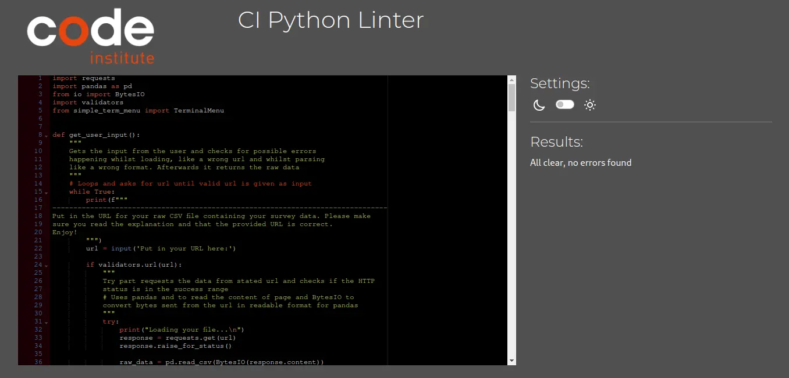

Click on the following link to get back to the [README.md](README.md).
## Testing
Each function was rigorously tested during development to ensure it is now fully operational and working as intended. Also, the code was passed through the Code Institute [PEP8 CI Python Linter](https://pep8ci.herokuapp.com/).

### Validator Testing
Here is the result of the PEP8 validator testing:

### Testing Data
For testing purposes, I used a file containing testing data that can be found [here](https://raw.githubusercontent.com/MrMarlonM/product-survey-analysis/main/example-data.csv).

The testing data contains intentionally some missing values and some wrong answers to demonstrate that the program is able to sort out the faulty rows and proceed with the analysis as intended.

### Manual Testing
To ensure the program is working as intended, I also tested the deployed project on Heroku. It can be found [here](https://product-survey-analysis-0eda41c09d36.herokuapp.com/).  
I worked my way down from the first point of the Main Menu and tested every functionality down to the last possible option, then proceeded with the second option of the Main Menu and then tried the Quit option.  
At last, I tested the error handling through some possible wrong user input.  

#### Functionality Test
| Action | Expected Result | Did it work? | Notes |
| --- | --- | --- | --- |
| Enter Start | User gets asked to enter URl  | Yes | - |
| Press [s] for Start | User gets asked to enter URL | Yes | - |
| Input URL and Enter | Overview of Data and Sub Menu is shown | Yes | - |
| Enter Analysis Questions | Calculates and shows Mean and Mode | Yes | - |
| Press [q] for Analysis Questions | Calculates and shows Mean and Mode | Yes | - |
| Enter Back to Sub Menu | Shows the Sub Menu  | Yes | - |
| Press [b] for Back to Sub Menu | Shows the Sub Menu | Yes | - |
| Enter Analysis Products | Calculates and shows Mean and Mode | Yes | - |
| Press [p] for Analysis Products | Calculates and shows Mean and Mode | Yes | - |
| Enter Back to Sub Menu | Shows the Sub Menu | Yes | - |
| Press [b] for Back to Sub Menu | Shows the Sub Menu | Yes | - |
| Enter Back to Main Menu | Shows the Main Menu | Yes | - |
| Press [b] for Back to Main Menu | Shows the Main Menu | Yes | - |
| Enter Show Explanation | Shows the Explanation | Yes | - |
| Press [e] for Show Explanation | Shows Explanation | Yes | - |
| Enter Back to Main Menu | Shows the Main Menu | Yes | - |
| Press [b] for Back to Main Menu | Shows the Main Menu | Yes | - |
| Enter Quit | Stops the program | Yes | To restart reload windows or press "Run Program" |
| Press [q] for Quit | Stops the program | Yes | To restart reload windows or press "Run Program" |

#### Input mistake response
| Problem | What should happen? | Did it work? |
| --- | --- | --- |
| User presses enter without input | Loops the input request until input is provided | Yes |
| Invalid URL is provided | Loops the input request until valid input is provided | Yes |
| Typo in URL  | Show custom error message to inform user and go back to Main Menu | Yes |
| Wrong file format | Show custom error message to inform user and go back to Main Menu | Yes |
| Wrong answers in data or missing values | Delte rows with wrong input or missing input and proceed analysis | Yes |